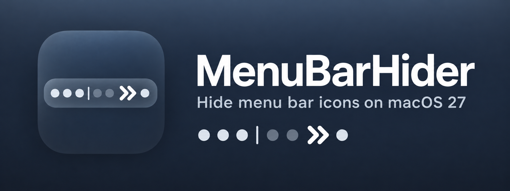
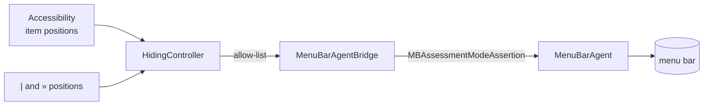

<p align="center">
  
</p>

<p align="center">
  <a href="https://github.com/happy666End/MenuBarHider/releases"></a>
  
  <a href="LICENSE"></a>
</p>

<p align="center">
  
</p>

**MenuBarHider** hides menu bar icons on macOS 27, where Hidden Bar, Ice and most
other managers stopped working. Two separators live in your menu bar: everything between
`|` and `»` is hidden, one click on `»` brings it back, and it folds away again after a
timeout.

```
  [always visible]  |  [hidden]  »  [always visible]      expanded
  [always visible]  »  [always visible]                    collapsed
```

No Screen Recording permission, no screenshots of your menu bar, no telemetry.
Accessibility permission only.

## Why another one

macOS 27 rewrote the menu bar: every status item used to be its own window, now the
whole bar is one window drawn by `MenuBarAgent`. Tools that inflated a status item's
width (Hidden Bar) or dragged item windows off screen (Ice, old Bartender) became no-ops
overnight. MenuBarHider talks to `MenuBarAgent` directly, the same way the paid managers
that survived do, but it is small, open and free.

## Install

Requires macOS 27. Download `MenuBarHider-x.y.z.zip` from the
[latest release](https://github.com/happy666End/MenuBarHider/releases/latest), unzip it and
drag **MenuBarHider.app** to *Applications*. The app is signed with a Developer ID and
notarized, so it opens without Gatekeeper warnings.

On first launch grant **Accessibility** in *System Settings → Privacy & Security →
Accessibility*. The app picks it up within two seconds, no restart needed.

### Build from source

Needs Xcode 26.3 or newer and [xcodegen](https://github.com/yonaskolb/XcodeGen).

```bash
brew install xcodegen
git clone https://github.com/happy666End/MenuBarHider.git
cd MenuBarHider
make install        # builds Release, copies to /Applications, launches
```

The default build is ad-hoc signed, which works everywhere but has one drawback: every
rebuild produces a new signature and macOS forgets the Accessibility grant. If you have an
Apple developer certificate, sign with it so the grant survives rebuilds:

```bash
make install SIGN_IDENTITY="Developer ID Application" TEAM=XXXXXXXXXX
# or put those two lines into local.mk (git-ignored) once
```

## Use

1. ⌘-drag the `»` separator to the right of the icons you want to hide.
2. Click `»` to reveal them, click again to hide, or wait for the auto-hide timer.
3. While expanded, a second separator `|` appears. ⌘-drag it right past any icon that
   should stay visible even though it sits left of `»`.

Right-click either separator for the menu:

| Item | What it does |
|---|---|
| Show Hidden Items / Hide Items | Same as a left click |
| Rescan Layout | Re-read which icons sit between `\|` and `»` |
| Auto-hide After | Never, 5 s, 10 s, 30 s, 1 min |
| Launch at Login | Registers with `SMAppService` |

The hidden set is recomputed every time the bar collapses, so reordering icons while it
is expanded just works. Apps launched while the bar is collapsed stay visible until you
move them behind the separator.

## How it works



- **Hiding.** `MenuBarAgent` exposes a visibility-restriction service: *"show only these
  system items and these bundle identifiers"*. Its client lives in the private
  `MenuBarClientCore.framework` as `MBAssessmentModeAssertion`, and it is the one service
  there that requires no entitlement. The app loads the framework with `dlopen`, builds an
  allow-list of every running app minus the hidden ones, and activates the assertion.
  Releasing it restores the bar instantly.
- **Which icons.** Positions of third-party items come from each app's
  `AXExtrasMenuBar`; the separators are the app's own `NSStatusItem`s. The scan runs
  concurrently across apps and takes about 100 ms.
- **Degradation.** If Apple removes the framework or the class, the menu says
  *Hiding unavailable on this macOS build* and nothing else changes.

### The Notification Center catch

The restriction is what macOS uses for exam (assessment) mode, and that mode deliberately
blocks Notification Center. With the restriction active a click on the clock does nothing:
BetterTouchTool has exactly this bug open. MenuBarHider lifts the restriction while the
pointer hovers the clock and puts it back half a second after the pointer leaves. An
already-open panel survives the restriction, so widgets keep working; the price is that
hidden icons show while the cursor sits on the clock.

## Caveats

- Private API. Apple can close it in any 27.x update; the app will report it instead of
  crashing, but hiding will stop until a workaround exists.
- Items without a bundle identifier cannot be allow-listed and stay hidden whenever the
  bar is collapsed.
- Multi-display setups are untested; the separators are measured on the primary display.

## Development

```bash
make gen      # xcodegen generate (project.pbxproj is not committed)
make test     # unit tests for the pure logic
make lint     # swiftlint + swift-format, configs are in the repo
make build    # Release build into build/
make release  # signed + notarized zip in dist/ (needs TEAM and a notarytool profile)
```

## License

[MIT](LICENSE)
